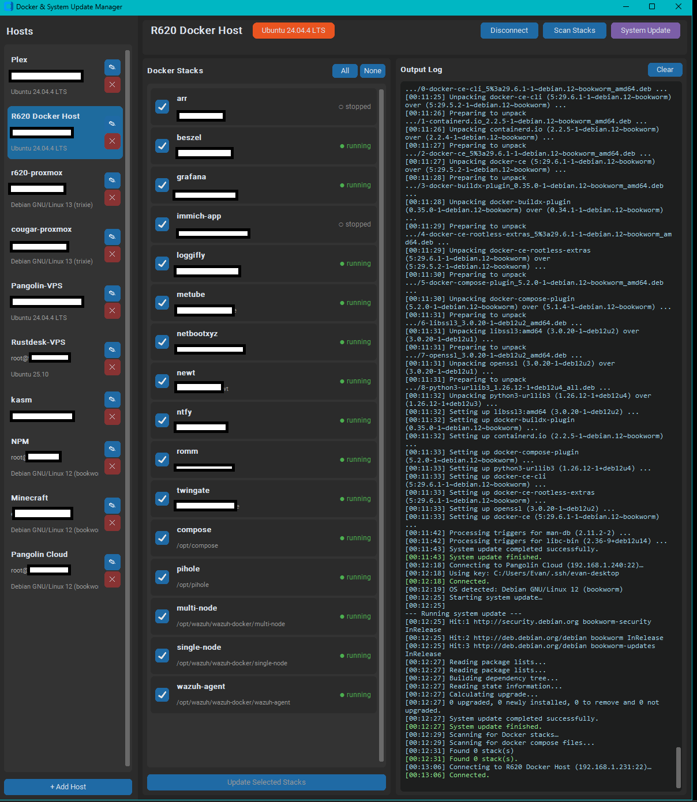
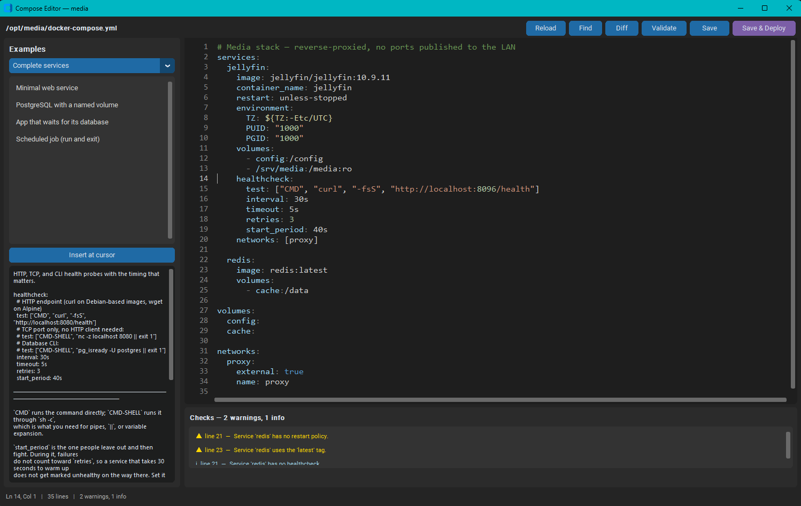

# Docker Stack Manager

A desktop GUI for managing and updating Linux hosts and Docker Compose stacks over SSH.

   [](https://github.com/fozzy1144/DockerStackManager/actions/workflows/tests.yml)

---

## Features

- **Multi-host management** — add as many Linux hosts as you need; switch between them with one click
- **Import from your SSH config** — pulls in the same hosts VS Code Remote-SSH uses, including key paths, so a machine you already reach from the editor is one click from being managed here
- **Secure credentials** — passwords stored in the OS credential manager (Windows Credential Manager); never written to disk in plaintext
- **SSH key support** — connect with a private key file instead of (or alongside) a password
- **Host key verification** — a host's key is remembered the first time you connect, and a later *change* is reported instead of silently accepted
- **OS detection** — identifies the distribution on connect, falling back to `ID_LIKE` so derivatives work too; colour-coded badge per distro
- **Docker stack discovery** — combines what Docker itself reports with a pruned filesystem scan, so it finds both running projects and stacks that have never been started
- **Selective stack updates** — checkboxes let you pick exactly which stacks to pull and recreate
- **System package upgrades** — runs the right package manager (`apt`, `dnf`, `pacman`, `apk`, `zypper`) for the detected OS
- **Works as root or not** — detects passwordless `sudo` and whether your user can reach the Docker socket, and escalates only when it has to
- **Bulk operations** — check for updates or run a full system update across every host at once, several hosts in parallel
- **Live log output** — stack pulls and package upgrades stream line by line as they happen, and can be saved to a file
- **Compose editor** — edit a stack's compose file in place with YAML highlighting, live checks, an example library, a diff before saving, host-side validation, and an automatic timestamped backup
- **Per-stack control** — container list with health and published ports, lifecycle buttons (up, restart, stop, pull, recreate, down), and log following per service
- **Image update checks** — asks each image's registry whether a newer version exists, without downloading layers, and says "unknown" rather than guessing when it cannot tell
- **Rollback** — every update records the image versions it replaced, so a bad pull can be undone
- **Disk housekeeping** — `docker system df` at a glance, with selective pruning of images, containers, build cache, and volumes
- **Fast failure when a host is down** — an unreachable host is reported in seconds with the reason, and the window stays usable while a connection is pending

## Screenshots

Hosts, stacks and live output in one window. Each stack has **Manage** and **Edit**; the sidebar shows pending OS updates per host, including a host that could not be reached.



The compose editor: YAML highlighting, the documented example library on the left, and the checks panel calling out an unpinned tag and a missing restart policy.



> Hosts, addresses and stacks shown above are fictional; the addresses come from the IANA documentation ranges reserved for exactly this purpose.

## Requirements

- Python 3.12+
- A Linux host reachable over SSH

## Installation

```bash
git clone https://github.com/fozzy1144/DockerStackManager.git
cd DockerStackManager
pip install -r requirements.txt
```

Or install it as a package, which also puts a `docker-stack-manager` launcher on
your PATH:

```bash
pip install .
```

## Running

**Windows:**

```bat
run.bat
```

**Any platform:**

```bash
python main.py
```

## Usage

### Importing the hosts you already have

Click **Import…** next to *+ Add Host*. This reads your OpenSSH config — which is exactly where **VS Code Remote-SSH** gets its host list from, so anything you connect to in the editor shows up here.

Read from `~/.ssh/config`, or from `remote.SSH.configFile` if you have set it in VS Code. `Include` directives are followed, and OpenSSH's rules are honoured: a `Host` line may carry several patterns, and the *first* value obtained for a keyword wins (which is why `Host *` defaults belong at the bottom of the file). `Match` blocks are skipped, because their conditions depend on the connection being attempted.

Each row says what importing it would do:

| | Meaning |
| --- | --- |
| **add** | Not configured here yet — a new host, labelled with its SSH alias. |
| **attach key** | Already configured, but without the `IdentityFile` your SSH config names. |
| **no change** | Already configured, or no `User` in the config to import. |

Nothing is written until you press Import, and passwords are never read from the SSH config — key files are referenced by path, not copied.

Attaching a key does not disable password authentication: both are offered, so a host that only accepts a password keeps working. If a host needs a password for `sudo` as well as a key to log in, set the password in **Edit** — see [Privileges](#privileges).

1. Click **+ Add Host** and enter the hostname/IP, port, username, and either a password or an SSH key file.
2. Select the host from the sidebar and click **Connect**.
3. Click **Scan Stacks** to discover all Docker Compose projects on the host.
4. Check or uncheck stacks, then click **Update Selected Stacks** to pull new images and recreate containers.
5. Optionally click **System Update** to run a full OS package upgrade.

Or skip straight to **Check All Updates** / **Update All Hosts** in the sidebar to work across every configured host at once.

### Managing one stack

Each discovered stack has two buttons.

**Manage** opens a window with the stack's containers — service name, state, health, image, and published ports — plus lifecycle actions and log following:

| Action | Command | Notes |
| --- | --- | --- |
| Up | `up -d` | Creates or updates containers to match the file. |
| Restart | `restart` | Restarts in place; does not re-read the compose file. |
| Stop | `stop` | Containers stay defined and can be started again. |
| Pull | `pull` | Fetches images without touching what is running. |
| Recreate | `up -d --force-recreate` | Rebuilds containers even if nothing changed. |
| Down | `down` | Removes containers and the network. **Named volumes are kept.** |

Logs stream with a tail length, an optional service filter, and follow on or off. **Stop** terminates the remote `logs -f` rather than abandoning it.

**Check images** asks each image's registry whether a newer version exists. Only manifests are fetched — no layers are downloaded — by comparing the digest the registry serves for a tag against the digest the local copy is stored under. `docker buildx imagetools` is preferred because it reports the *index* digest, which is what a multi-architecture image is recorded under locally; `docker manifest inspect` is the fallback.

When it cannot tell, it says **unknown** and why. That is deliberate: a false "up to date" hides a security update, and a false "update available" trains you to ignore the indicator. The honest unknown cases are a registry it cannot reach, an image not present locally, and a multi-arch image on a host without buildx.

**Roll back** restores the image versions recorded before the last update. Every update through this application snapshots each image's ID first — IDs, not tags, because a pull moves the tag and leaves the previous image on disk untagged, identifiable only by ID. Rollback re-tags those IDs and forces a recreate. Rollback points are stored per stack directory and carried across stack rescans, so they outlive both the rescan that follows an update and the session itself.

It refuses, without changing anything, if any recorded image has since been removed from the host: a partial rollback would leave the stack matching neither version. `docker image prune` deletes untagged images, so pruning discards your rollback points — worth knowing before using **Cleanup**.

**Edit** opens the compose editor — see below.

### Editing a compose file

The editor reads the file over SFTP (falling back to `sudo cat` for root-owned files), and on save writes it back through a temp file copied over the original, so the destination keeps its owner and permissions. A timestamped backup is left beside it as `docker-compose.yml.bak.20260725-143000`.

Three things happen before anything is written:

1. **Live checks** as you type — offline, instant. They flag the mistakes that only surface after a restart: an unpinned tag, a missing restart policy, a volume referenced but never declared, two services fighting over one host port, a password sitting in plaintext. Click a finding to jump to the line.
2. **`docker compose config` on the host**, which resolves `.env` interpolation, override files, and anchors exactly as the deploy will. It runs against the real stack directory, so what it validates is what will run.
3. **Diff** shows precisely what will change.

Neither check blocks a save you insist on — each asks first.

**Examples** on the left holds documented service configurations. Pick one to read what it does and what to customise, then insert it at the cursor with the right indentation. The same material is in [docs/compose-reference.md](docs/compose-reference.md), generated from the identical source so the two cannot drift.

Shortcuts: `Ctrl+S` save, `Ctrl+F` find/replace, `F5` validate, `Tab`/`Shift+Tab` indent or outdent the selection, `Ctrl+Z`/`Ctrl+Y` undo and redo.

### What an update actually does

Per selected stack, from the stack's own directory:

```bash
docker compose pull      # if this fails, the stack is left alone
docker compose up -d
```

A failed pull deliberately aborts before `up`, because recreating containers against half-fetched images is how a routine update becomes an outage. Stack statuses are re-scanned when the run finishes.

## Where things are stored

| What | Where |
| --- | --- |
| Passwords and key passphrases | OS credential manager, under the service `DockerStackManager` |
| SSH host aliases and key paths | Read from `~/.ssh/config` on import; never written to |
| Hosts, ports, key paths, discovered stacks | `~/.docker_stack_manager/hosts.json` |
| Accepted SSH host keys | `~/.docker_stack_manager/known_hosts` |

No credentials are ever written to `hosts.json` or to the project directory. The config file is written atomically — an interrupted save leaves the previous version intact rather than a truncated file — and a single malformed record is skipped at startup instead of stopping the app.

## Supported Linux distributions

| Distro family | Package manager |
| --- | --- |
| Debian, Ubuntu, Mint, Pop!\_OS, Raspbian, Kali, Devuan, elementary | `apt-get` |
| Fedora, RHEL, CentOS, Rocky, AlmaLinux, Oracle, Amazon Linux | `dnf` / `yum` |
| Arch, Manjaro, EndeavourOS, Garuda | `pacman` |
| Alpine | `apk` |
| openSUSE, SLES | `zypper` |

Anything else falls back to its `ID_LIKE` family, and finally to `apt-get`. Unrecognised distros are called out in the log so the guess is visible rather than silent.

## Privileges

System updates need root. The app works this out per host, in order:

1. Logged in as `root` — commands run directly.
2. Passwordless `sudo` available — uses `sudo -n`, and your stored password never goes over the wire.
3. Otherwise — the stored password is fed to `sudo -S` on stdin.

Docker commands follow the same idea: if your user cannot reach the Docker socket (not in the `docker` group), stack operations are escalated automatically.

> **Key-only hosts:** if a host authenticates with an SSH key and has no stored password, there is nothing to give `sudo`. Either configure passwordless `sudo` for that user or log in as `root`. The log says so explicitly rather than hanging on an invisible prompt.

## Troubleshooting

| Symptom | Cause |
| --- | --- |
| *"the host appears to be offline"* | No TCP answer within the probe budget. The device is off, asleep, or firewalled. |
| *"refused the connection"* | The host is up but nothing is listening on that port — check `sshd` and the port number. |
| *"Cannot resolve …"* | DNS, or a typo in the hostname. Try the IP address. |
| *"Host key … has changed"* | The server was rebuilt, or the connection is being intercepted. Verify, then remove the stale line from `~/.docker_stack_manager/known_hosts`. |
| *"Authentication failed"* | Wrong password, or a key whose passphrase is not the stored one. |
| System update fails immediately | No route to root — see [Privileges](#privileges). |
| No stacks found | Compose files live outside the scanned roots (`/opt`, `/srv`, `/home`, `/root`, `/docker`, `/stacks`, `/data`). A full-tree scan runs automatically if the first pass finds nothing. |
| Update count looks stale | Counts come from the package lists already on the host; refreshing them needs root. Run a system update to resynchronise. |
| Editor cannot save | The compose file needs root and passwordless `sudo` is not configured — see [Privileges](#privileges). The backup and the write happen together, so a failure changes nothing. |
| Log viewer shows nothing | The stack's logging driver is not `json-file` or `local`; `docker compose logs` cannot read `syslog` or `journald`. |
| Image check says *unknown* | The registry was unreachable, the image is not pulled yet, or it is multi-arch and the host has no `docker buildx`. It never guesses. |
| Rollback refuses | A recorded image is gone from the host — usually because `docker image prune` removed it, since a superseded image is untagged. |
| Import found nothing | VS Code Remote-SSH reads `~/.ssh/config`; if your hosts live elsewhere, point `remote.SSH.configFile` at that file. |

## Architecture

```text
DockerStackManager/
├── main.py                  # Entry point
├── run.bat                  # Windows launcher
├── requirements.txt
├── pyproject.toml           # Package metadata and dependency bounds
├── docker-stack-manager.spec  # PyInstaller build for the Windows executable
├── models/
│   └── host.py              # Host, DockerStack, Container
├── core/
│   ├── distro.py            # Per-distro package-manager commands and badge colours
│   ├── credentials.py       # Keyring secrets + atomic/deferred config persistence
│   ├── compose.py           # Compose parsing, linting, diffing (no network)
│   ├── snippets.py          # Documented example configurations
│   ├── ssh_config.py        # OpenSSH config parser + import planning
│   └── ssh_client.py        # SSH transport: connect, probe, run, stream, transfer
├── gui/
│   ├── app.py               # Main window and action coordination
│   ├── theme.py             # Shared severity and state colours
│   ├── host_list.py         # Sidebar host cards
│   ├── host_dialog.py       # Add/Edit host dialog
│   ├── import_dialog.py     # Pick hosts to import from the SSH config
│   ├── log_panel.py         # Batched, thread-safe output log
│   ├── code_editor.py       # YAML editor widget: gutter, highlighting, find
│   ├── compose_editor.py    # Editor window: examples, checks, diff, save
│   ├── stack_window.py      # Containers, actions, images, rollback, logs
│   └── maintenance.py       # Disk usage and pruning
├── tools/
│   └── gen_compose_docs.py  # Regenerates docs/compose-reference.md
└── tests/                   # stdlib unittest; no dependencies required
```

Run the tests with either runner:

```bash
python -m pytest
python -m unittest discover -s tests -t .
```

They need no host, no display, and no network. Three of them are guards on
things that drift silently rather than on behaviour:
`tests/test_gen_compose_docs.py` fails if `docs/compose-reference.md` no longer
matches the snippet library, and `tests/test_packaging.py` fails if
`requirements.txt` and `pyproject.toml` disagree or the PyInstaller spec loses a
hidden import it needs.

[GitHub Actions](.github/workflows/tests.yml) runs the suite on Windows against
Python 3.12 and 3.13, re-runs the compose tests with PyYAML *uninstalled* to
keep the degraded path honest, imports every GUI module, and freezes the
executable.

For a coverage report:

```bash
pip install -e ".[dev]"
python -m pytest --cov=core --cov=gui --cov=models --cov-report=term-missing
```

CI enforces a floor so the figure can only go up. Where the gaps are, and why:
`core/` is well covered because none of it needs a display, and `core/compose.py`
and `models/host.py` are effectively complete. The remainder is concentrated in
two places — the parts of `core/ssh_client.py` that only run against a live host,
and widget construction in `gui/`, where the tests deliberately cover the pure
helpers and the lookup tables that have to agree with `core/` rather than
instantiating windows.

## Building a Windows executable

```bash
pip install -e ".[dev]"
pyinstaller docker-stack-manager.spec
```

The result is a single `dist/DockerStackManager.exe` that needs no Python on the
target machine. Two things in the spec are not automatic: CustomTkinter's themes
have to be collected as data files, and keyring's Windows backend has to be
named as a hidden import because it is found through entry points. CI builds
this on every run and attaches the executable as an artifact.

Four conventions hold the layers apart and are worth preserving:

**Distro knowledge lives only in `core/distro.py`.** `ssh_client` knows how to *run* a command, never *which* command; it is handed a `PackageManager` and executes its strings. Supporting a new distro is a one-line table entry, not a new branch in an `if`/`elif` chain.

**`core/` never imports from `gui/`.** Everything in `core/` is testable without a display, which is why the compose linter, the snippet library, the output pump, and the reachability probe all have real tests.

**Nothing blocks the UI thread.** Every network call runs on a worker thread and returns via `after()`. The one exception is logging: `LogPanel.log` is safe to call from any thread because it only enqueues, and a single timer drains the queue with one batched widget insert per tick — which is what keeps the window responsive while `apt` streams thousands of lines.

**Config writes never block the window.** `save_hosts_async` serialises on the calling thread — so the snapshot cannot tear — and defers only the disk write, coalescing bursts into one. A bulk check finishing on nine hosts at once costs a single write. On shutdown the deferred writer is flushed *first* and the final save then made synchronously, because a deferred write must neither die with the process nor land after — and overwrite — the last save.

**A pending connection must not lock the window.** Connecting deliberately does *not* set the busy flag, and the attempt is tracked by a token so switching hosts mid-connect abandons it. An apparently frozen window while a dead host timed out was a real bug; the reachability probe and this token are the two halves of the fix.

## Documentation

- [docs/compose-reference.md](docs/compose-reference.md) — every example configuration with customization notes, plus the full list of checks the editor runs. Generated from `core/snippets.py`; run `python tools/gen_compose_docs.py` after editing the library.

## License

MIT
